<a href="./assets/JASResume2023.pdf" target="_blank">My Resume</a>

### Skills: SystemVerilog, C, ARM, Python, MATLAB

## Education
B.S. Electrical and Computer Engineering  
University of Washington, Seattle (_June 2024_)  
Concentration: VLSI Design / Digital Systems Design

## Experience

**Capstone Controls Lead @ T-Mobile/UW (_Jan 2024 - Present_)**
- Working on a team with T-Mobile to implement 3D RF coverage mapping using drone data.
- Responsible for writing automated flight mapping software to collect RF/network data.
- Developing a machine learning model to interpolate 3D data.

**President @ UW Engineering Student Council (_June 2023 - Present_)**
- Presides over monthly UWESC meetings.
- Currently writing new UWESC constitution for 2023-24.
- Organized career fair that raised $40,000 for student clubs 

**Engineer @ Li3Go (_June 2022 - Aug 2023_)**
- Implemented a patented multi-grid power management system using Python on a prototype class A motorhome retrofitted with solar panels.
- Designed hardware agnostic database schema to support multiple brands of solar inverters.
- Inventor on USPTO Patent Number US11130422B1.

**Vice President @ Husky Flying Club (_Sept 2020 - Present_)**
- Successfully planned, pitched, and managed a $105,811 grant to build the first UW light-sport aircraft awarded by the Student Tech Fund Committee.

**Student Tech Support @ Spokane Public Schools (_June - Sept, 2018 - 2021_)**
- Upgraded hardware and software, organized and restructured computer labs.
- Assisted in preparing 60,000 student laptops for the rapid adoption of online learning due to COVID-19.

## Projects
Due to University policy I am not able to publicly post code or files for many of these projects, but if you're curious (and not a UW student) feel free to reach out on LinkedIn for any files or code.  
(If any images are too small, right click -> open image in new tab)

### VLSI
#### 16-bit Register File
The final lab of my introductory VLSI course was to manually design a 16-bit register file from scratch using Cadence Virtuoso. The specifications were 13 words of 16-bit registers that have 1 synchronous write and 2 asynchronous reads.  

The first order of business was to verify DRC/LVS for every single cell going all the way from a single inverter to the large 4:13 decoders. Below is the LVS report for my first ever inverter (all hand drawn).
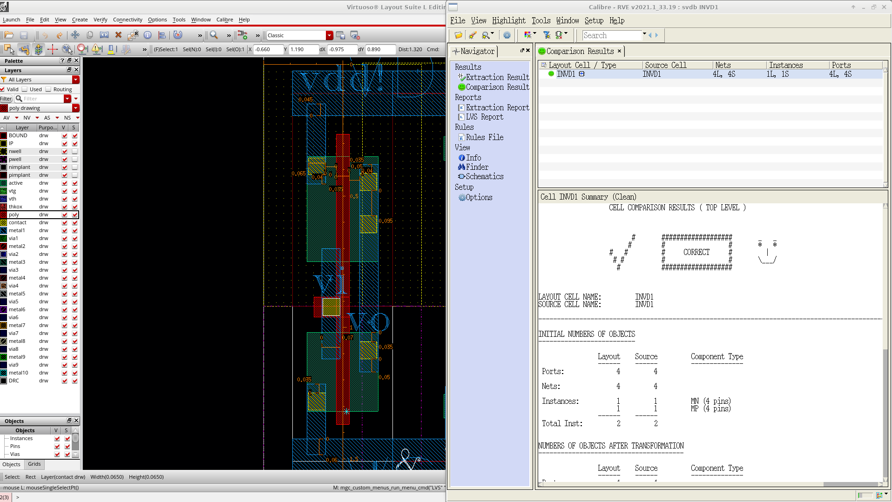  

Next I had to get a D-Flip-Flop layout completed which would later be split into master/slave latches for the register file. Below is 16 DFF's chained together to create an LFSR that can be used for populating data into the Register File.
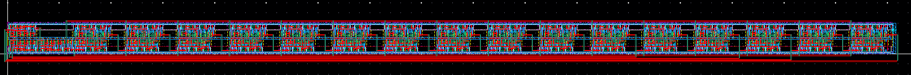  

Once I designed and created the layout for the 4:13 decoders, the final Register File layout began, remember completely manual no scripting! In the end I believe it was around 48 hours of total consecutive work. Below is the critical path highlighted through the write address decoder, write-enable AND gates, and a D-Flip-Flop for each bit column to synchronize the write. 
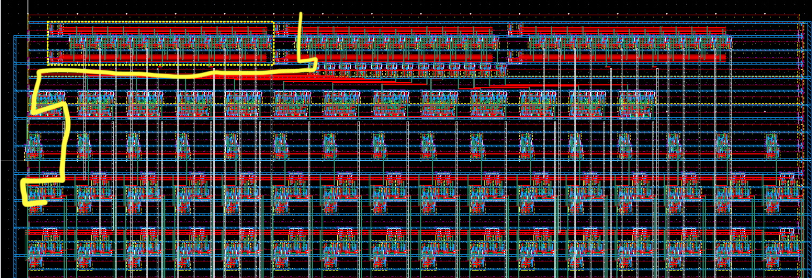  

Finally below is a zoomed out picture of the complete Register File.
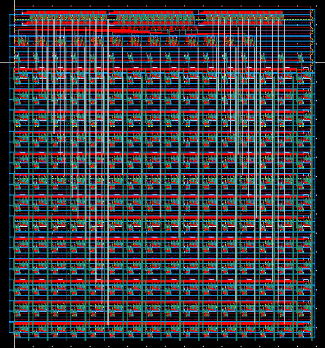  

#### Greatest Common Denominator Accelerator  
In my VLSI II class we use the Cadence Suite of VLSI tools. Also Synopsys for RTL/debug, and Mentor Graphics for DRC/LVS. High-level flow: RTL Simulation (Synopsys VCS) -> Verilog Synthesis (Genus) -> Formal Analysis (Conformal LEC) -> Place-and-Route (Innovus) -> Formal Analysis again -> DRC/LVS (Calibre) -> PPA Analysis (Tempus).  

The first milestone in VLSI II was a hardware accelerated Euclidean greatest common denominator algorithm. The pseudo code is below.
```
Function GCD (inA, inB, outY)
  A = inA
  B = inB
  Done = False
  while (Done == False):
    if (A < B): 
      swap A and B
    elif (B != 0):
      A = A - B
    else:
      Done = True
  outY = A
```  
In the lab specifications A and B are 32-bits. To achieve a hardware accelerator, Verilog modules from the UW Bespoke Silicon Groups's [basejump_stl](https://github.com/bespoke-silicon-group/basejump_stl) library were used. To pass in data bsg_link was used and compromised the majority of the ASIC layout, however this made testing and interfacing very simple. Shown below is the output from Innovus with floorplanning, bsg_link_downstream is highlighted in blue and bsg_link_upstream in yellow.  
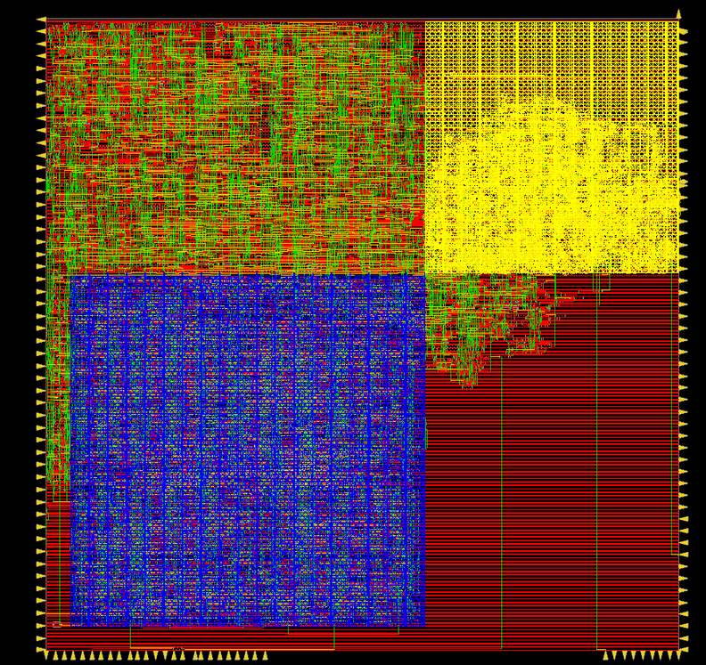  
The design was pushed through Conformal LEC for logical equivalency, DRC/LVS, and Tempus for PPA. Below is the merged GDS file viewed in klayout.
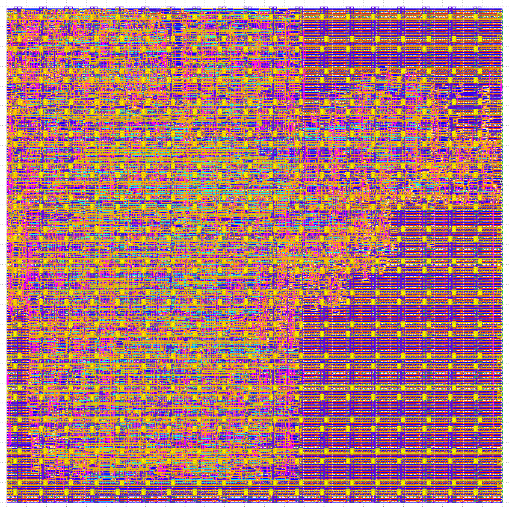

#### Conway's Game of Life Accelerator  

### Computer Architecture
#### Pipelined CPU
The final lab of my introductory Computer Architecture course was the implementation of a 5-cycle pipelined ARM CPU from _Digital Design and Computer Architecture ARM® Edition_ by Sarah L. Harris and David Money Harris. Below is the textbook's CPU diagram complete with hazard protection and pipelining.
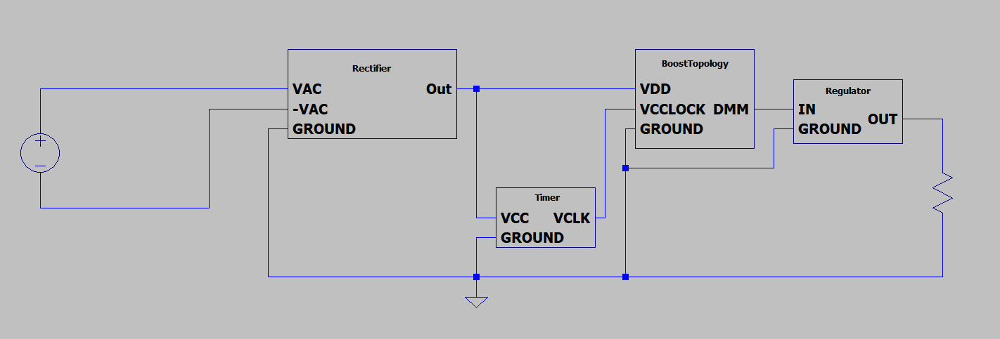  

As they say, there is only one way to eat an elephant: one bite at a time. So I began by moving up in layers of abstraction starting at the very beginning, a 1-bit full-adder SystemVerilog module. Then, writing a 32-bit full-adder module. Now with a 32-bit full adder, I was able to write an ALU for arithmetic operations. And after writing the register file module, I was able to begin splitting up the CPU by segmenting each cycle (Fetch, Decode, Execute, Memory, Writeback) into a separate SV module. This is the block diagram with each control signal going between each stage.
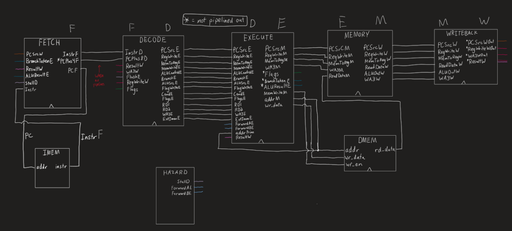  


Next it was simply a matter of consulting the ARM reference manual for the various instructions with their respective machine code, setting ALUFlags with the Cond unit and implementing the combinational logic of the Hazard Unit. Finally, I wrote a simple ARM program to make use of stalling, flushing, and branching. Below is a screenshot from the top-level module of the CPU executing the test program, each line is one of the various control signals accessible by the top-level module. Take note of the PCPlus8D (Program Counter) line moving through each word of the instruction memory.
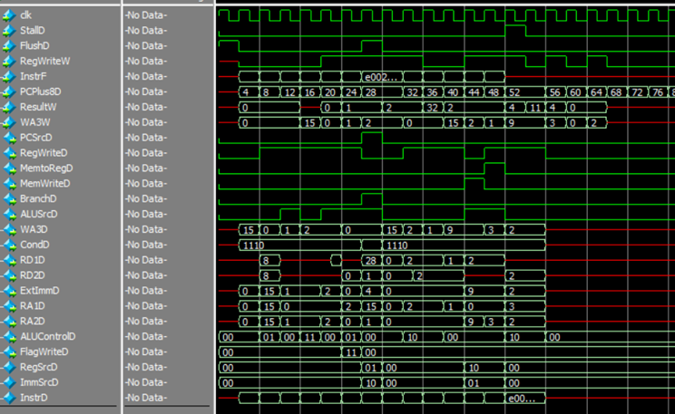

#### IEEE-754 Addition
Another task was the implementation of <a href="./assets/img/p1d.png" target="_blank">IEEE-754</a> floating point addition in ARMv7 Assembly. The steps given in the Harris and Harris textbook are as follows:
1. Extract exponent and fraction bits.
2. Prepend leading 1 to form the mantissa.
3. Compare exponents.
4. Shift smaller mantissa if necessary.
5. Add mantissas.
6. Normalize mantissa and adjust exponent if necessary.
7. Round result.
8. Assemble exponent and fraction back into floating-point number.  

Below is the ARM implementation commented with C pseudo-code.
```ARM
floatAddition:
	// R1 = A, R2 = B, R0 = return value (result)
	PUSH {R3, R4, R5, R6, R7, R8}
	MOVW R8, #0xFFFF         // exponentMask = 0x7F800000
	MOVT R8, #0x7F
	MOVW R7, #0x0            // mantissaMask = 0x7FFFFF
	MOVT R7, #0x7F80
	AND R3, R1, R8           // mantissaA = (A & mantissaMask) | mantissaLeadingOne
	ORR R3, R3, #0x800000
	AND R4, R1, R7           // exponentA = (A & exponentMask) >> 23
	LSR R4, R4, #23
	AND R5, R2, R8           // mantissaB = (B & mantissaMask) | mantissaLeadingOne
	ORR R5, R5, #0x800000
	AND R6, R2, R7           // exponentB = (B & exponentMask) >> 23
	LSR R6, R6, #23
	
	exponentLoop:
		CMP R4, R6
		BEQ addMantissas     // while exponentA != exponentB
		MOVLT R3, R3, LSR #1 // if (exponentA < exponentB) mantissaA >>= 1; exponentA++
		ADDLT R4, R4, #1
		MOVGT R5, R5, LSR #1 // else mantissaA >>= 1; exponentA++;
		ADDGT R6, R6, #1
		B exponentLoop
		
	addMantissas:
		ADD R7, R3, R5     // addedMantissa = mantissaA + mantissaB
	
	CMP R7, #0x1000000    // if addedMantissa > mantissaOverflowBit
	MOVGT R7, R7, LSR #1  // addedMantissa >>= 1
	ADDGT R4, R4, #1      // exponentA++
	
	AND R7, R7, R8        // result = (addedMantissa & mantissaMask) + (exponentA << 23)
	MOV R0, R4, LSL #23
	ADD R0, R7, R0
	
	POP {R3, R4, R5, R6, R7, R8}
	MOV PC, LR               // return result

END:
```

### Circuit Design and Analysis
For the final lab of my EE331 course, students were tasked with designing an adjustable AC to DC power supply from scratch. The power supply took in 7.5V RMS AC current and output 10-20V DC adjustable with a potentiometer. Below is the block diagram for my design.  
  

The final schematic for my design:
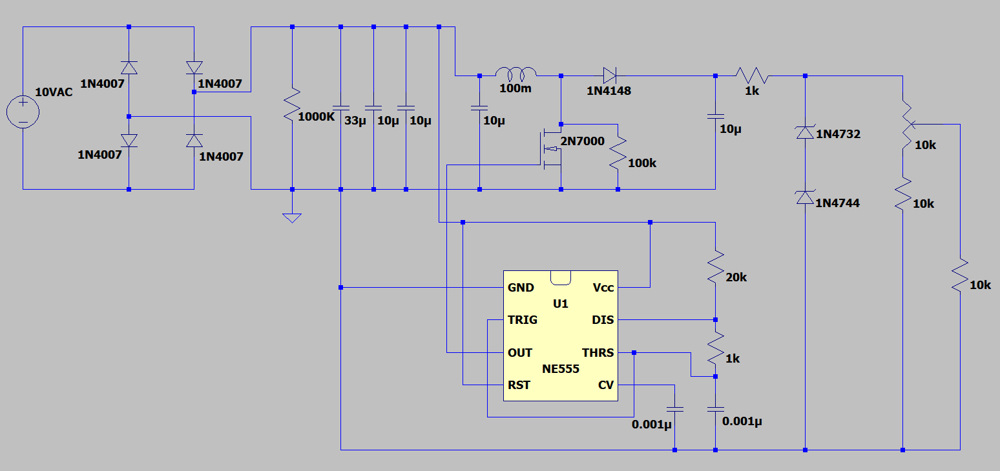  

And this is my simulation results measuring the DC output across a 10k load. Each line is a different simulated 'percentage' on the potentiometer.
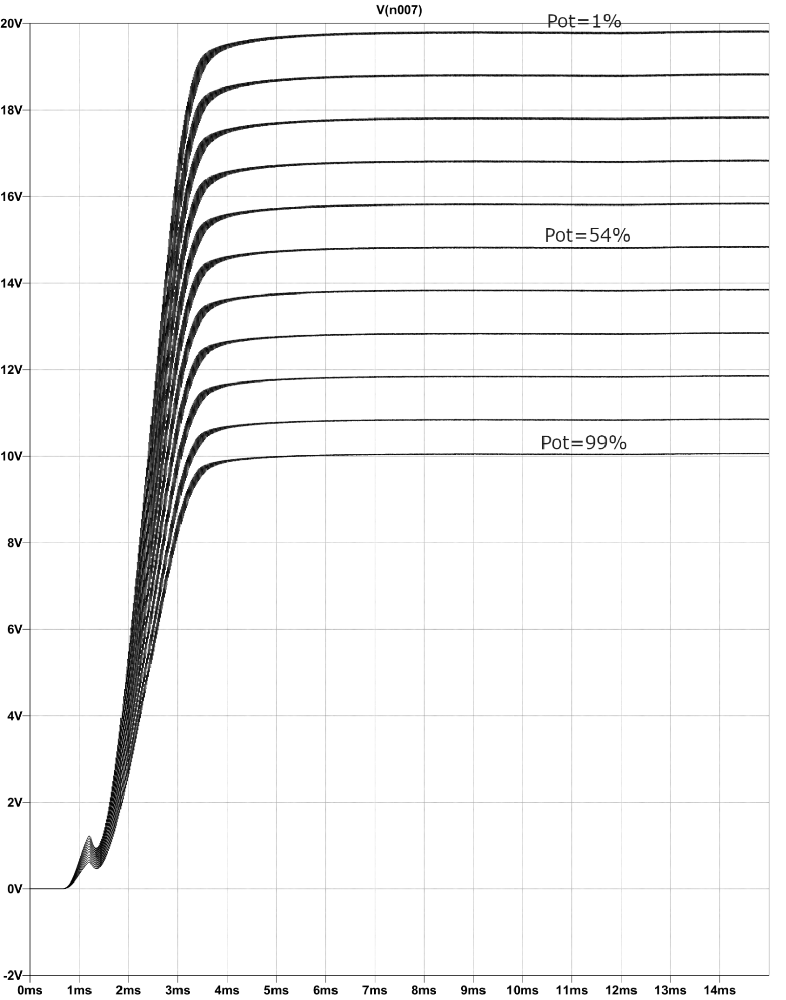

### Signals Processing

#### Audio Filtering
Here is an example of audio smoothing I implemented using NumPy, SciPy, and matplotlib. First I create a random noisy audio signal.

```python
# Base and noise signal

sample_rate = 1000 
time  = np.arange(0,2,1/sample_rate) 
n = len(time)

p = 10 # points for piecewise linear signal
amp = 20   # amplitude range of base signal
base = np.interp(np.linspace(0,p,n),np.arange(0,p),np.random.rand(p)*amp)

# Create some random noise to be added to the above base signals
noiseamp = 2
noise = noiseamp * np.random.randn(n)

noisy = noise + base
```
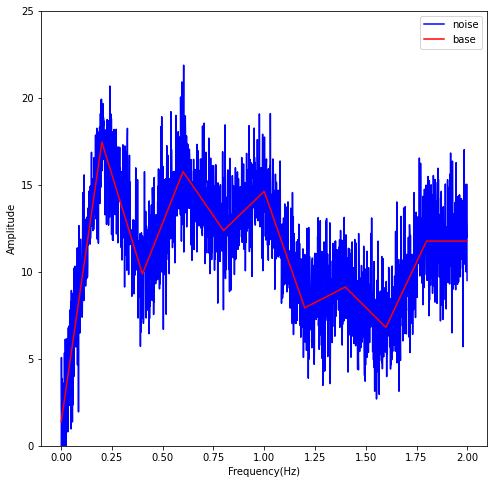

Next, using convolution I smooth the signal with SciPy.
```python
# Use signal.lfilter to apply my filter

mean_filter = np.zeros(len(noisy))
k = 10

N = 2 * k + 1

a = [1]
hfilt = np.ones(N)* 1/N
b = hfilt

filtsig1 = np.convolve(base, hfilt)
time1 = np.arange(0,2020)
time2 = np.arange(0,2000)

fig = plt.figure(figsize = (8,8))
plt.plot(time1, filtsig1, color = 'blue')


filtsig2 = sig.lfilter(b, a, noisy)
plt.plot(time2, filtsig2, color = 'red')
```
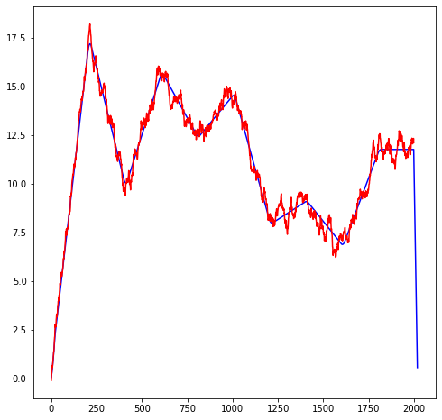

### Personal Projects
My passion for digital logic and the 'magic' of what makes computers work has been a long affair. I vividly remember being 11 years old and getting Ron White's _How Computers Work: The Evolution of Technology_ for Christmas (my parents are also nerds). The book had plain and understandable illustrations of logic gates, RAM layouts, adders, flip-flops, and many other topics of what I now understand as Computer Architecture. At the time I had a very limited conception of everything but the mystery was part of the fun. 

#### Briel Computers Altair 8800-Micro
For my 12th birthday, the only thing I asked for was a Briel Computers Altair 8800-Micro, sadly they are no longer available anywhere online. At this point I was obsessed with computer history and loved the story of Paul Allen writing a bootloader for Microsoft 8k BASIC on an airplane for the Altair 8800. He famously didn't test it at all before a very important meeting that started Microsoft as we know it.  

This is the front panel of the kit, which I assembled in 2014. It uses 16-bit octal input for the addresses and 8 bits for the data. Using an Intel-8080 reference manual you can manually input machine code using the switches and execute assembly instructions.
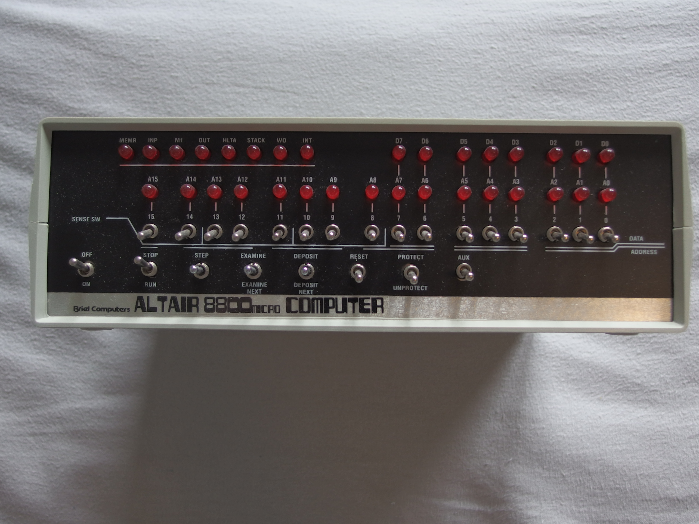

Inside there is a Floppy Drive emulator that reads from an SD card so you can load CP/M or 8k BASIC. The pictured battery pack allows for persistent storage after power-off. You can actually download the 1975 version of Microsoft BASIC, load it onto the SD card, and manually program the infamous bootloader on the front panel just like Paul Allen in 1975!
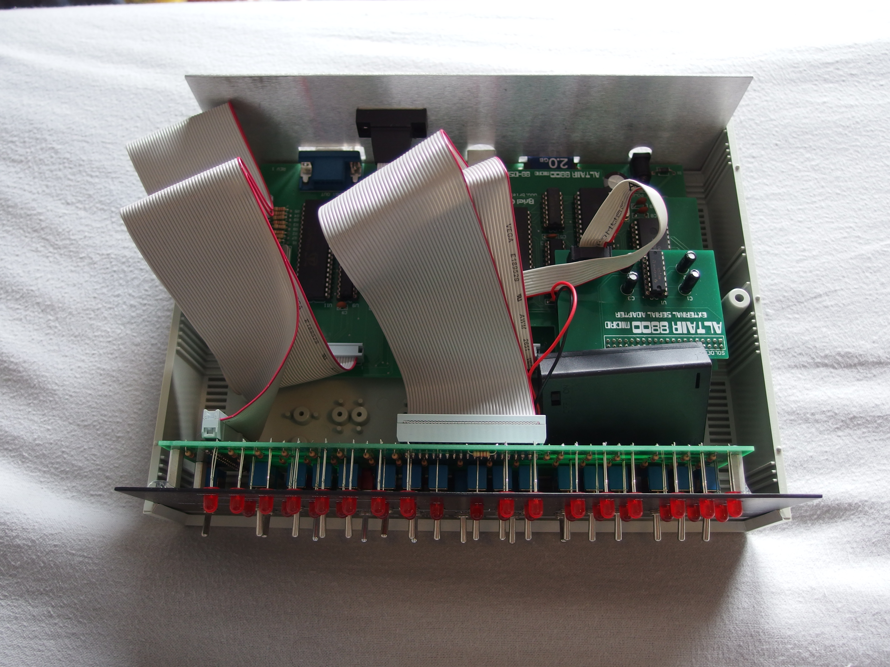

Under the hood, the kit uses an Atmel ATmega which is essentially an Arduino CPU emulating an Intel-8080 with several 8k RAM chips. In this photo you can make out my terrible 12-year-old soldering job.
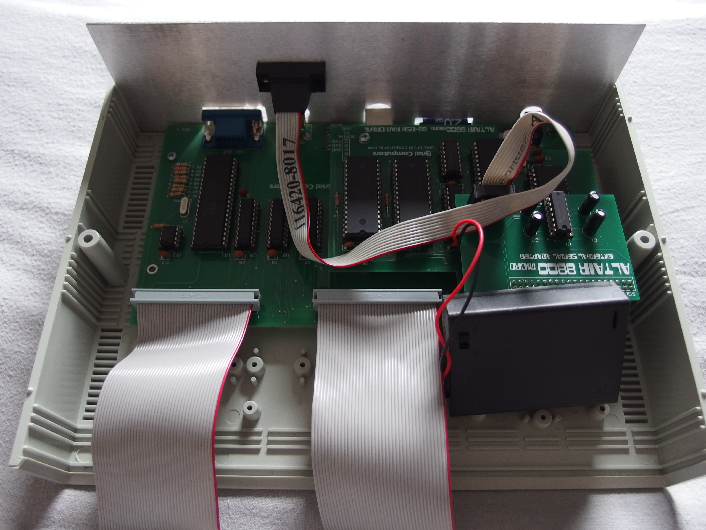

#### PiDP-8/I

In 2016, my first year of high school, I constructed a <a href="https://obsolescence.wixsite.com/obsolescence/pidp-8" target="_blank">PDP-8 replica kit </a>that uses a Raspberry Pi Zero. It's a significantly less complicated kit that does all of the emulation on Linux using custom software instead of dedicated hardware. But the custom acrylic front panel and bamboo case is much more visually appealing.
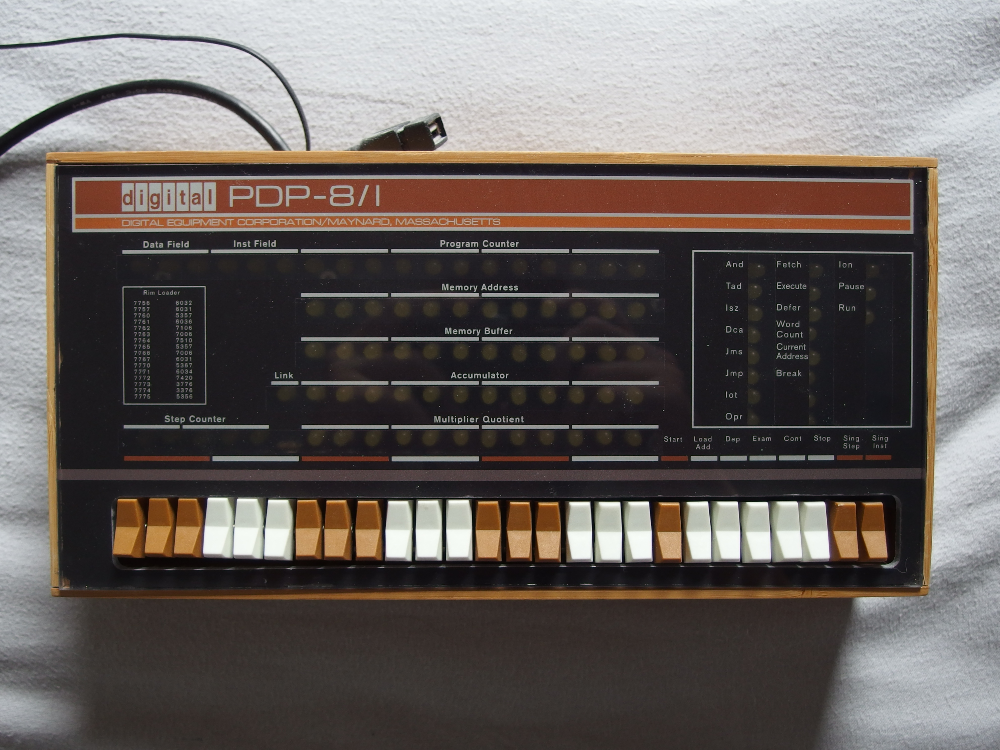

#### PDA Collection

I also have a small collection of 2000s PDAs, I only ever regularly used the Handspring Visor. Something about the functional efficiency using such bare-bones hardware is very appealing to me.
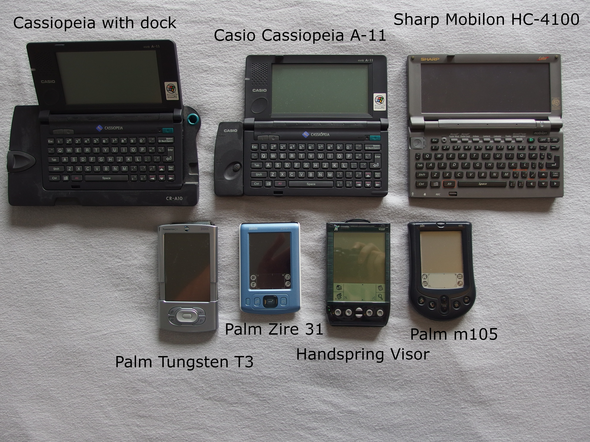
