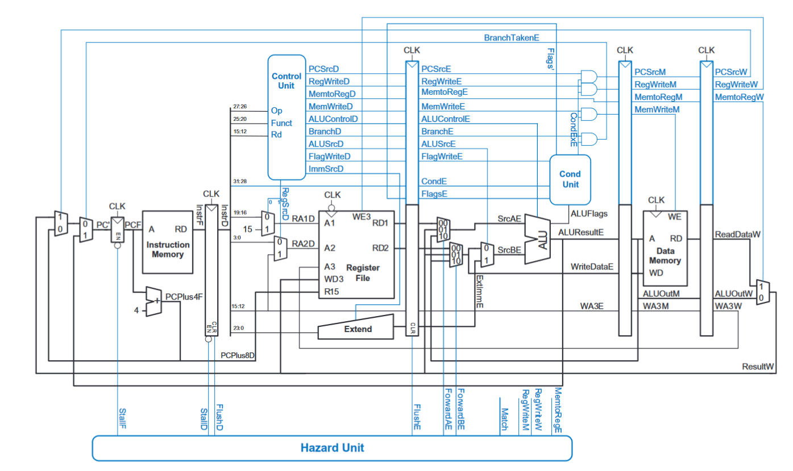

<a href="./assets/JASResume2023.pdf" target="_blank">My Resume</a>

### Skills: C, ARM, SystemVerilog, Python, MATLAB

## Education
B.S. Electrical and Computer Engineering  
University of Washington, Seattle (_June 2024_)  
Concentration: VLSI Design / Digital Systems Design

## Experience

**President @ UW Engineering Student Council (_June 2023 - Present_)**
 - Wrote new UWESC Constitution, not yet ratified.

**Engineer @ Li3Go (_June 2022 - Present_)**
- Implemented a patented multi-grid power management system using Python on a prototype class A motorhome retrofitted with solar panels.
- Designed hardware agnostic database schema to support multiple brands of solar inverters.

**Vice President @ Husky Flying Club (_Sept 2020 - Present_)**
- Successfully planned, pitched, and managed a $105,811 grant to build the first UW light-sport aircraft awarded by the Student Tech Fund Committee.

**Student Tech Support @ Spokane Public Schools (_June - Sept, 2018 - 2021_)**
- Upgraded hardware and software, organized and restructured computer labs.
- Assisted in preparing 60,000 student laptops for the rapid adoption of online learning due to COVID-19.

## Projects
Due to University policy I am not able to publicly post code or files for many of these projects, but if you're curious (and not a UW student) feel free to reach out on LinkedIn for any files or code.  
(If any images are too small, right click -> open image in new tab)

### Computer Architecture
#### Pipelined CPU
By graduation, I will have taken at least six computer architecture courses using SystemVerilog, and C on the ARMv7 architecture. So far, the most challenging task I've completed is the implementation of a 5-cycle pipelined ARM CPU from Digital Design and Computer Architecture ARM® Edition by Sarah L. Harris and David Money Harris. Below is the textbook's CPU diagram complete with full hazard protection and pipelining.
  

As they say, there is only one way to eat an elephant: one bite at a time. So I began by moving up in layers of abstraction starting at the very beginning, a 1-bit full-adder SystemVerilog module. Then, writing a 32-bit full-adder module. Now with a 32-bit full adder, I was able to write an ALU for arithmetic operations. And after writing the register file module, I was able to begin splitting up the CPU by segmenting each cycle (Fetch, Decode, Execute, Memory, Writeback) into a separate SV module. This is the block diagram with each control signal going between each stage.
  


Next it was simply a matter of consulting the ARM reference manual for the various instructions with their respective machine code, setting ALUFlags with the Cond unit and implementing the combinational logic of the Hazard Unit. Finally, I wrote a simple ARM program to make use of stalling, flushing, and branching. Below is a screenshot from the top-level module of the CPU executing the test program, each line is one of the various control signals accessible by the top-level module. Take note of the PCPlus8D (Program Counter) line moving through each word of the instruction memory.


#### IEEE-754 Addition
Another task was the implementation of <a href="./assets/img/p1d.png" target="_blank">IEEE-754</a> floating point addition in ARMv7 Assembly. The steps given in the Harris and Harris textbook are as follows:
1. Extract exponent and fraction bits.
2. Prepend leading 1 to form the mantissa.
3. Compare exponents.
4. Shift smaller mantissa if necessary.
5. Add mantissas.
6. Normalize mantissa and adjust exponent if necessary.
7. Round result.
8. Assemble exponent and fraction back into floating-point number.  

Below is the ARM implementation commented with C pseudo-code.
```ARM
floatAddition:
	// R1 = A, R2 = B, R0 = return value (result)
	PUSH {R3, R4, R5, R6, R7, R8}
	MOVW R8, #0xFFFF         // exponentMask = 0x7F800000
	MOVT R8, #0x7F
	MOVW R7, #0x0            // mantissaMask = 0x7FFFFF
	MOVT R7, #0x7F80
	AND R3, R1, R8           // mantissaA = (A & mantissaMask) | mantissaLeadingOne
	ORR R3, R3, #0x800000
	AND R4, R1, R7           // exponentA = (A & exponentMask) >> 23
	LSR R4, R4, #23
	AND R5, R2, R8           // mantissaB = (B & mantissaMask) | mantissaLeadingOne
	ORR R5, R5, #0x800000
	AND R6, R2, R7           // exponentB = (B & exponentMask) >> 23
	LSR R6, R6, #23
	
	exponentLoop:
		CMP R4, R6
		BEQ addMantissas     // while exponentA != exponentB
		MOVLT R3, R3, LSR #1 // if (exponentA < exponentB) mantissaA >>= 1; exponentA++
		ADDLT R4, R4, #1
		MOVGT R5, R5, LSR #1 // else mantissaA >>= 1; exponentA++;
		ADDGT R6, R6, #1
		B exponentLoop
		
	addMantissas:
		ADD R7, R3, R5     // addedMantissa = mantissaA + mantissaB
	
	CMP R7, #0x1000000    // if addedMantissa > mantissaOverflowBit
	MOVGT R7, R7, LSR #1  // addedMantissa >>= 1
	ADDGT R4, R4, #1      // exponentA++
	
	AND R7, R7, R8        // result = (addedMantissa & mantissaMask) + (exponentA << 23)
	MOV R0, R4, LSL #23
	ADD R0, R7, R0
	
	POP {R3, R4, R5, R6, R7, R8}
	MOV PC, LR               // return result

END:
```

### Circuit Design and Analysis
For the final lab of my EE331 course, students were tasked with designing an adjustable AC to DC power supply from scratch. The power supply took in 7.5V RMS AC current and output 10-20V DC adjustable with a potentiometer. Below is the block diagram for my design.  
  

The final schematic for my design:
  

And this is my simulation results measuring the DC output across a 10k load. Each line is a different simulated 'percentage' on the potentiometer.


### Signals Processing

#### Audio Filtering
Here is an example of audio smoothing I implemented using NumPy, SciPy, and matplotlib. First I create a random noisy audio signal.

```python
# Base and noise signal

sample_rate = 1000 
time  = np.arange(0,2,1/sample_rate) 
n = len(time)

p = 10 # points for piecewise linear signal
amp = 20   # amplitude range of base signal
base = np.interp(np.linspace(0,p,n),np.arange(0,p),np.random.rand(p)*amp)

# Create some random noise to be added to the above base signals
noiseamp = 2
noise = noiseamp * np.random.randn(n)

noisy = noise + base
```


Next, using convolution I smooth the signal with SciPy.
```python
# Use signal.lfilter to apply my filter

mean_filter = np.zeros(len(noisy))
k = 10

N = 2 * k + 1

a = [1]
hfilt = np.ones(N)* 1/N
b = hfilt

filtsig1 = np.convolve(base, hfilt)
time1 = np.arange(0,2020)
time2 = np.arange(0,2000)

fig = plt.figure(figsize = (8,8))
plt.plot(time1, filtsig1, color = 'blue')


filtsig2 = sig.lfilter(b, a, noisy)
plt.plot(time2, filtsig2, color = 'red')
```


